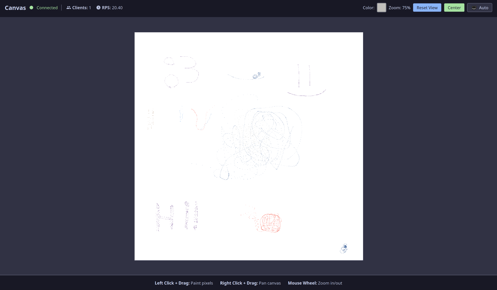

# [canvas](https://canvas.shymike.dev)

A big and fast real time canvas made using Rust and SvelteKit!

---

## SDKs

### Python

A Python SDK for the custom protocol is available on PyPI with the name "[canvas-protocol](https://pypi.org/project/canvas-protocol)".

It's source code is located [in this repository](./sdk/python/README.md).

## Protocol

The server utilizes a custom data transfer protocol with many custom requests and responses:

### Request Types

| Name         | Format (with byte size)                      | Example                               |
|--------------|----------------------------------------------|---------------------------------------|
| SetPixel     | `[type:1][coords:3][rgb:3] = 7`              | `[1][coordinates as u32][rgb as u32]` |
| GetPixel     | `[type:1][coords:3] = 4`                     | `[2][rgb as u32]`                     |
| GetAllPixels | `[type:1] = 1`                               | `[3]`                                 |
| GetStats     | `[type:1] = 1`                               | `[4]`                                 |

### Response Types

| Name              | Format (with byte size)               | Example                                 |
|-------------------|---------------------------------------|-----------------------------------------|
| SetPixelBroadcast | `[type:1][coords:3][rgb:3] = 7`       | `[10][coordinates as u32][rgb as u32]`  |
| PixelColor        | `[type:1][coords:3][rgb:3] = 7`       | `[10][coordinates as u32][rgb as u32]`  |
| Error             | `[type:1][pixels:3*n] = 1 + 3*n`      | `[11][rgb as u32]...`                   |
| GetAllPixels      | `[type:1][rgb:3] = 4`                 | `[12][rgb as u32]`                      |
| Stats             | `[type:1][client_count:2][rps:4] = 7` | `[13][client count as u16][rps as f32]` |

### Errors

| Name               | Format |
|--------------------|--------|
| InvalidMessageType | `[1]`  |
| OutOfBounds        | `[2]`  |
